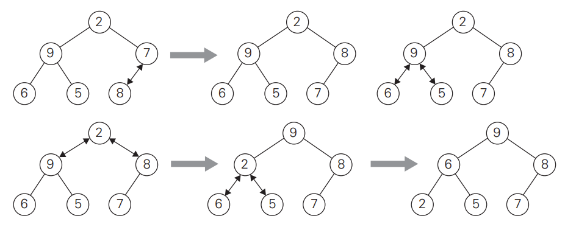

# Algorithms and Complexities - CS350 - David Ely
Office: FAB 120-17
Hours: TBA

Text: Introduction to the Design and Analysis of Algorithms, Third Edition, Anany Levitin

Grading Policy:
- Homework/Lab: 30% (lowest score will be dropped)
- Midterm: 35% of frade
- Final: 35% of grade
- 0 on either the final or the midterm will result in a failure of the class


## Notes 04/04/2023
What is a computer algorithms?
- A set of instruction

Sorting algorithms:
- Merge sort
- Bubble
- Quick
- Selection
- BOGO

In Algorithms there are two things we care about
- **Time complexity**
  - How much constant time operation was there?
  - Ex: x = x + 1;

- **Space complexity:**
  - How much memory overhead are we using?

To measure either Time or Space complexity we use:
-   Asymptotic Analysis, aka: Big '0'

## Notes 03/12/2023: 

**Homework, due next week Wednesday before class (04/19/2023):**
- Merge sort
- To canvas, upload a .c or .cpp file
- From scratch, a single file
- **Input**:
  - n: where n is the amount of data
  - data: double data type, any numbers you want
  - Something like this:
```c 
int n;
double x[1000], data;

scanf("%d", &n); // n is number of data item the user will input next

for( int i = 0; i < n ++i) {
    scanf("%lf", &data);
    x[i] = data;
}
```
- **Output**:
  - Print the unsorted data
  - Run merge sort
  - Print data again

### Heap Sort:

T(n) = n * lg(n)

|   | 0  |1 |2 |3 |4 |5 |6 |7 |8 |9 | 10 | 11 | 12 | 13 | 14 |
|---|----|---|---|---|---|---|---|---|---|---|----|----|------|----|----|
| A |95 | 83 | 74 | 80 | 50 | 62 | 70 | 43 | 76 | 49 | 15 | 12 | 60 | 14 | 64 |
```
              95              
           /      \           
      83              74      
     /  \            /  \     
  80      50      62      70  
 /  \    /  \    /  \    /  \
43  76  49  15  12  60  14  65
```

So what is the index of the left child of any given node?
- **2x + 1**

The right child?
- **2x + 2**

Now what is the parents index from a given child?
- $$ x-1 /over 2 $$


## Notes 5/12/2023


### Heap and Heapsort:

What is a *heap*? It is a clever, partially ordered data structure that is especially suited to implementing priority queues.
A **priority queue** is a multiset of items with an order-able characteristic, called a **priority**, meaning that there is something we can organize these 
items by, whether size, number, height, weight, etc. These items have the following operations:
- Finding an item with the highest priority
- Deleting an item with the highest priority
- Adding a new item to the multiset

It is an efficient implementation of these operations that makes the heap interesting and useful,
Priority queues arise naturally in applications such as schedulers.

**Heap Definition**
A **heap** can be defined as a binary tree with keys assigned to its nodes, one key per node, provided the following two conditions are met:
- The **Shape property** - the binary tree is **complete**, meaning that all the levels are full except possibly the last level, and the last levels nodes are as far left as possible.
- The **parental dominance** or **heap property** - the key in each node is greater than or equal to the keys in its children. AKA: The parent node has to be greater than both it's children.

Important Properties of heaps:
- There exists exactly one essentially complete binary tree with *n* nodes. Its height is equal to log_2_(n)
- The root of a heap is always contains its largest element.
- A node of a heap is considered with all its descendants is also a heap.
- A heap can be implemented as an array by recording its elements in the top down, left to right fashion. It is convenient to store
elements in positions 1 through *n* of such an array, leaving H[0] either unused or putting there a sentinel whose
value is greater than very element in the heap. In such a reperesentation:
  - the parental node keys will be in the first n/2 positions of the array, while the leaf keys will occupy the last n/2 positions
  - The children o a key in the arrays parental position *i* where (1 <= i <= (n/2)) will be in positions 2i and 2i + 1, and the parent of a key will be i positions i where (2 <= i <= n)) will be i positions i/2

So, we could define a heap as an array H[1..n] where every element in position *i* in the first half of the array is greater than or equal to the elements in positions 2i and 2i + 1



Bottom up first initializes the complete binary tree with *n* nodes by placing kleys in the order given, **then** *heapifies* the tree, as shown above, starting with teh last parental node.

Algorithm
```C
//Input: An array H[1..n] or orderable items
//Output: A heap H[1..n]

for( i = n/2; i != 1; i--) {
  int k = i;
  int v = H[k];
  boolean heap = false;
  while(!heap && (2 * k) <= n) {
      int j = 2 * k;
      if (j < n) { // Two children
          if(H[j] < H[j+1]) {
              j++;
          }
          if (v >= H[j]) {
              heap = true;
          } else {
              H[k] = H[j];
              k = j;
          }
      }
  }
  H[k] = v;
}
```

**Heapsort**
Heapsort is a two stage sorting algorithm.
Stage 1: (Heap construction), construct a heap for a given array.
Stage 2: (Maximum deletions), apply the root deletion operations (n-1) times to the remaining heap.

Example of stage one:

2  9  **7**  6  5  8

2 **9**  8  6  5  7  

**2**  9  8  6  5  7

9  **2**  8  6  5  7  

9  6  8  2  5  7  


### Asymptotic Notations
Informally, O(g(n)) is the set of all functions with a lower or same order of growth as g(n), to within a 
constant multiple, as *n* goes to infinity.

A few examples, all the following are true:

  - *n* in O(n^2), 
  - 100n + 5 in O(n^2),
  - .5*n(n-1) in O(n^2)

Some counter examples would be something like this:

n^3 is NOT in O(n^2)

0.00000001n^3 is NOT in O(n^2)


On the other hand, **Big Omega(g(n))**, is the set of all functions with a higher or same order of growth of g(n)
Example: n^3 is in Omega(n^2):
  n^3 >= n^2 for all n >= 0


**Big Theta** is denoted with t(n) is in Big Theta(g(n)) if t(n) is bounded botj above and below by some constant multiple of g(n) for all large n.
If there exists some positive constants c_1 and c_2 and some non-negative integer n_0 such that c_2*g(n) <= t(n) <= c_1*g(n) for all n >= n_0

Lets prove (1/2) * n(n-1) is in Big theta(n^2). First we prove the right inequality, upper bound

    (1/2) * n(n-1) = (1/2)n^2 - (1/2)n <= (1/2)n^2 for all n >= 0

Next we prove the left inequality, the lower bound
    
    (1/2) * n(n-1) = (1/2)n^2 - (1/2)n >= (1/4)n^2 for all n >= 2


**Time Complexities Notation**

O-**notation**

A function t(n) is said to be in O(g(n)), denoted t(n) in O(g(n)), if t(n) is bounded above by some constant multiple of g(n) for all large *n*, if there
exists some positive constant *c* and some non-negative integer n_0 such that `t(n) <= c*g(n) for all n >= n_0`

Example: let us formal prove one of the assertions made in the introduction: 100n + 5 in O(n^2)
100n + 5 <= 100n + n (for all n >= 5) = 101n <= 101n^2


### Notes 05/15/2023


